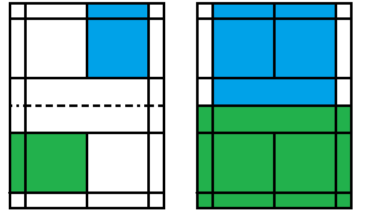

	version：Beta1.0

0. 没有提及且与下述规则不冲突的规则，以世界羽联规则为准。
# 一、分制
1. **比分暂定为15分制一局定胜负，对局双方同意后可将本局改为11分制，所有在场队员多数同意后可将下一轮对局做出调整，比如改为21分制或11分制3局2胜等**
2. 每球得分制：每回合中，取胜的一方加1分
3. . 当双方均为10/14/20分时，领先对方2分的一方赢得该局比赛  
4. 当双方均为29分时，先取得30分的一方赢得该局比赛 
5. 每局可经过赛前讨论双方同意后将前3分视为热身球不计分
6. 当领先的一方达到6/8/11分时场上队员有提出即可换边（赛前可提前约定）
7. **连赢三场的队伍，在赢下第三场后仍被判为输而下场，且该队伍可被在场人员讨论后拆分。**（目的是为保证游戏平衡）
# 二、边界
8. 比赛尽量为双打(非硬性要求，人数过多导致有人体验太差待机)
9. **暂定单打和双打队伍为单打界，三人及以上组队时则为双打界**（鉴于大家运动能力和游戏体验）
10. **关于是否出界(或是否过网)的争议球，经过讨论后可不计分(以裁判和比赛双方多数同意的结果为准)**
11. **每人每局允许一次过网击球或球落地前碰网不计分，本局之后再出现对面加一分**

注：上图左侧为发球有效区，右侧为除发球外有效区；其中蓝色为单打界（百多安规则的单打与双打界），绿色为双打界（百多安规则的三人及以上队伍边界）
# 三、发接发
12. **发球时击球高度不得高于中网**（放宽了，主要目的为防止抛球直接“扣杀”）
13. 发球需要发到对角框内，**无需按照比分限制到左或右**
14. **按照总分偶数换发，最后打平时每队发一个就换。但对局双方若同意，则可无视该换发顺序规则。（不按照国际羽联，而是类似乒乓球换发规则，即每队发俩换）**
15. 发球与对面接发球的队员只能在**发球前指定其中一位**，另外队员接球按照接发失误处理
16. **每队每球允许一次发球或接发失误不计分，连续失误两次对面加一分**
17. 鉴于大家发球能力欠缺，增加一个暂行规则：**每局双方都被允许一次申辩“对面发球直接扣杀”不计分的机会**。是否为发球直接扣杀，根据接发难度，球速等由比赛双方和裁判多数同意为准。该暂行规则较为影响游戏公平需尽快取消，愿大家发球质量节节高。
