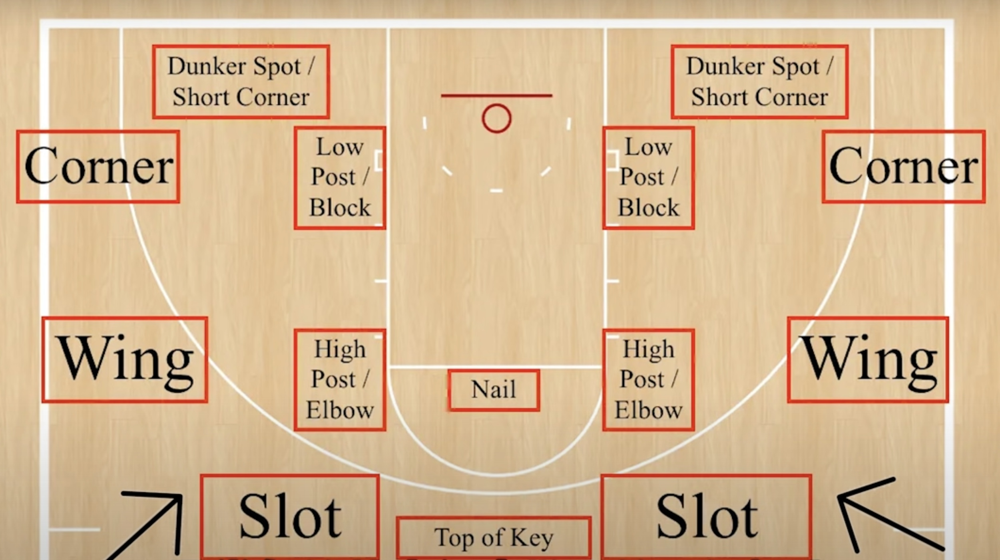

技术当然是基础，但也正因如此，战术是几乎所有篮球业余爱好者容易忽略的问题。我打过的野球场，多数情况下连基本的挡拆都做不好，无球掩护是根本不可能发生，这损失了很多篮球的可玩性。战术执行我只是会一些基本的，但就看球，我也懂的战术不多，我了解的球友更是看比赛只看个热闹，互联网上这方面的分享也少之又少。
但最近詹姆斯和雷迪克的博客Mind the game恰是这类型的，重新唤起了我对篮球的兴趣，尤其是战术方面。
# 术语

## 场上位置

### strong side and weak side
```chatgpt
在篮球术语中，“strong side”---强侧，指的是球场上球所在的那一侧，而“weak side”---弱侧，则是指球所不在的那一侧。这个区分对于理解篮球战术和防守布局非常重要。
```

## 队员职责
1. **Point Guard (PG) - 控球后卫**
    - 职责：球队进攻的组织者和指挥官，负责运球推进、分配球权、控制比赛节奏，以及防守对方的主要控球手。
2. **Shooting Guard (SG) - 得分后卫**
    - 职责：主要得分手之一，擅长远距离投篮和快攻得分，同时也参与防守，尤其是对抗对方的得分后卫。
3. **Small Forward (SF) - 小前锋**
    - 职责：多才多艺的球员，需要在得分、篮板和防守上都有所贡献，既能外线投篮，也能内线强攻。
4. **Power Forward (PF) - 大前锋**
    - 职责：在篮下攻防两端都非常关键，需要有良好的篮板球能力和内线得分能力，同时也要能够适应一定的外线投篮。
5. **Center (C) - 中锋**
    - 职责：通常是球队最高个子的球员，负责篮下的防守、篮板和封盖，以及提供内线的得分点。

# 基本战术
## screen

### split screen 

### stagger screen

### back screen(rip screen)

## cut
1. **Backdoor Cut（背门切入）**：
    - 当球员的防守者过于紧贴或预判传球路线时，进攻球员会突然改变方向，从防守球员背后切入篮下，寻找接球得分的机会。
2. **Baseline Cut（底线切入）**：
    - 球员从篮板一侧沿底线快速切入另一侧或篮下，这种切入通常用于逃脱紧逼防守或在进攻时寻找空位。
3. **Flash Cut（闪电切入）**：
    - 球员突然从一侧切到另一侧的自由投球线或篮下区域，通常是为了从密集的防守区域中接球。
4. **Give-and-Go Cut（传切）**：
    - 一种简单有效的进攻战术，球员传球给队友后立即切入篮下，寻求回传得分的机会。
5. **Curl Cut（弧形切入）**：
    - 球员围绕一个设屏的队友运动，做出弧线形切入动作，通常用于从屏障的外侧接球后快速进攻。
6. **V-Cut（V形切入）**：
    - 球员首先向场地一侧移动拉开距离，然后突然改变方向向篮球或空位切入，形成“V”形运动路线。
7. **Slot cut（槽位切入）**：
	- 球员从外线的"slot"区域（这个区域位于三分线顶部和篮板之间的延长线上）沿直线切入篮下的动作。
## double team
```chatgpt
"Double team"（双人包夹）是篮球中的一种防守策略，其中两名防守球员共同防守一个进攻球员，目的是迫使他放弃球权、犯错或做出困难的传球。这种策略经常用于对抗对方的主要得分手或是在关键时刻干扰对方的进攻节奏。
```
实际在应用double team的过程中，不同位置的球员过来包夹使用不同代号的，比如：
### tilt
a double team from the baseline
### fire
a double team from the nail
# 进阶战术
## pick and roll
就是挡拆，而pick也就是指screen。


### short roll
```chatgpt
"Short roll" 在篮球挡拆战术中是一个特定的动作，它发生在挡拆（pick and roll）战术的变体中，尤其是当防守方对挡拆做出调整时。在标准的挡拆中，设立屏障的球员（屏障者）在为持球者设立屏障后，通常会向篮筐深处滚动（roll），寻找得分机会。然而，在 "short roll" 中，屏障者在向篮筐滚动时选择在离篮筐较近的中距离区域接球，而不是继续深入到篮下。
```
### inverted pick and roll
```chatgpt
"Inverted Pick and Roll"（反向挡拆）是一种篮球进攻战术，其特点是颠倒了传统挡拆中球员的角色。在传统的挡拆（Pick and Roll）中，通常是大个子球员（如中锋或大前锋）为持球的后卫（如控球后卫或得分后卫）设立屏障，然后向篮筐滚动寻求得分机会。而在反向挡拆中，这些角色被颠倒了。

### 特点
- 角色颠倒：在反向挡拆中，通常是外线球员（后卫或小前锋）为内线球员（大前锋或中锋）设立屏障。
- 利用空间和错位：这种战术常常旨在利用大个子球员对抗身材较小的后卫的身体优势，或是利用外线球员的速度和技术优势。

### 实施要求
- 技术全面的球员：成功执行反向挡拆要求大个子球员具备良好的持球和决策能力，同时外线球员也需具备有效设立屏障的能力。
- 空间感：球员需要有很好的空间感和场上视野，能够根据防守的反应快速做出决策。
- 团队协作：如同所有挡拆战术，反向挡拆也需要良好的团队配合和时机掌握。

### 策略应用
反向挡拆因其不同寻常的配合方式，能够有效地创造防守混乱和错位，尤其是当大个子球员拥有较好的外线投射能力时，这种战术能够极大地提高进攻效率。在NBA等职业篮球赛事中，随着越来越多的大个子球员具备了全面的技术和外线投射能力，反向挡拆战术也越来越受到重视。
```

### spread pick and roll
```chatgpt
"Spread Pick and Roll"是篮球战术中的一个变种，它将传统的挡拆战术（Pick and Roll）与空间开阔的进攻理念结合起来。这种战术的特点是在执行挡拆的同时，其他三名球员分散在三分线周围，以最大化场地上的空间，从而拉开防守，并为持球者和设屏者创造更多的进攻机会。
```
### 5-out(delay)
也就是5名球员都在三分线外。

## 针对挡拆的战术
也就是：**switch** or **double team**；这两种也有进阶的形态和表达，见下文：
### ### hedge and blitz
```
在篮球的防守战术中，"Hedge" 和 "Blitz" 都是针对挡拆（Pick and Roll）进攻的应对方式，但它们在执行上有着明显的区别。

### Hedge（避让）
- 定义：当进攻方执行挡拆时，防守屏障者的队友（通常是大个子球员）会短暂地离开自己的防守对象，向持球者施加压力，目的是迫使持球者放慢脚步或改变进攻路线，同时给自己的队友（被屏障者）时间绕过屏障重新防守持球者。
- 特点：Hedge通常不是全力出击，而是一种中等程度的干扰。执行避让的防守球员在施加一定压力后，需要迅速回到自己原来的防守位置或对象。

### Blitz（双人包夹）
- 定义：与Hedge类似，Blitz也是在挡拆发生时的一种防守反应，但区别在于Blitz是一种更为激进的防守策略。当进攻方执行挡拆时，防守屏障者的队友（通常是另一位大个子球员）会和他一起对持球者实施紧密的双人包夹。
- 特点：Blitz的目的是迫使持球者尽快处理球，增加进攻方出现失误的可能性。这种策略通常在持球者非常擅长得分或比赛的关键时刻使用。执行Blitz的球员在完成包夹后，需要快速调整防守布局以防对手利用人数优势。
```

## corner splits
```chatgpt
"Corner Splits" 在篮球中是一种进攻战术，常见于以球星驱动的进攻体系，如金州勇士队在斯蒂芬·库里和克莱·汤普森领衔下的体系。这种战术以其在三分线角落分开进行屏障和移动而得名，目的是创造开放的投篮机会或驱动进攻路线。
在执行 "Corner Splits" 战术时，通常会有一名球员持球位于顶角或翼侧位置，而两名球员（通常是擅长射击的后卫）则位于底线两侧的角落。其中一名角落的球员会上屏给另一名角落的球员，企图混淆防守并为其中一人创造投篮或切入的机会。这种战术的关键在于迅速且精确的传球，以及球员之间的默契配合。
```


# 技术
