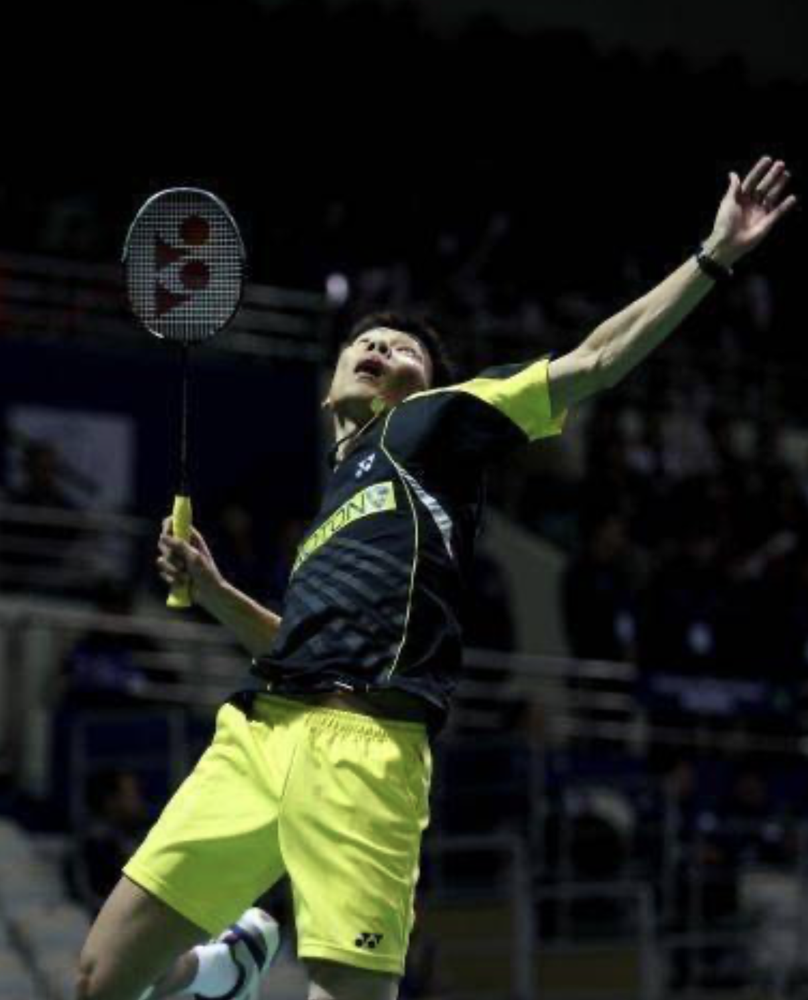
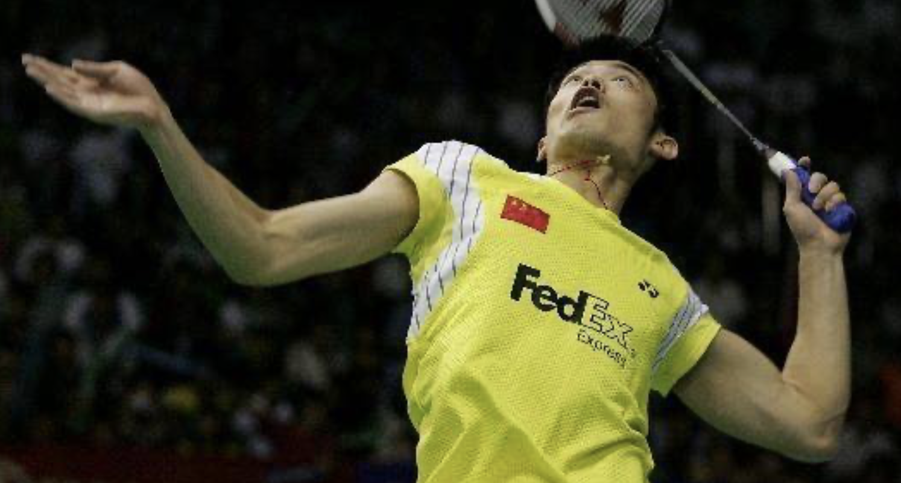
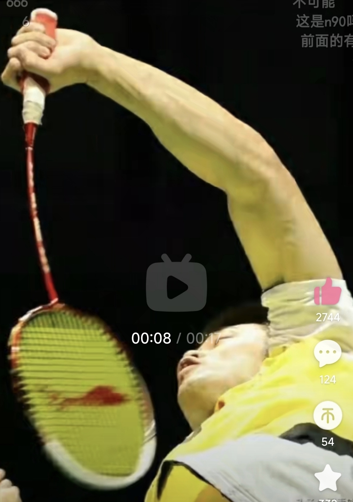
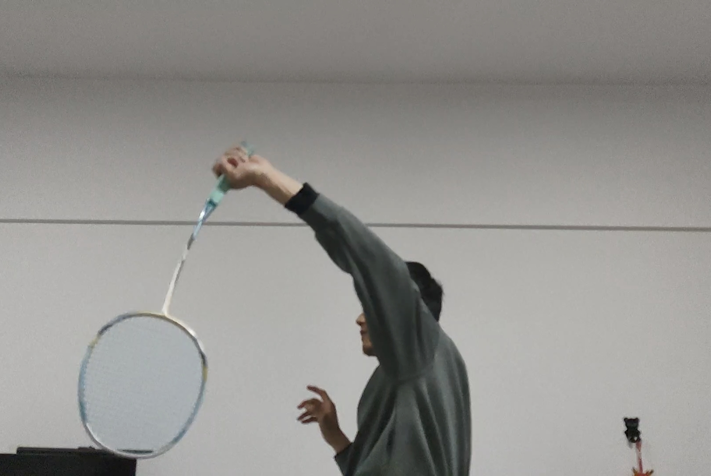
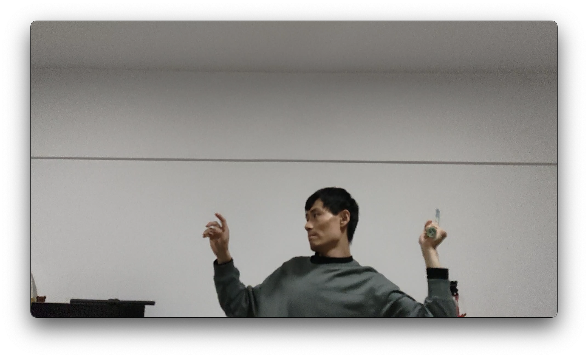
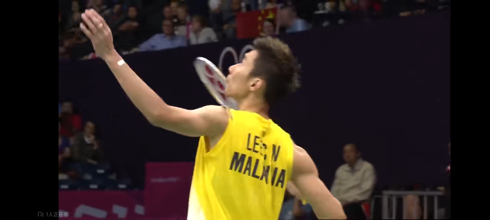
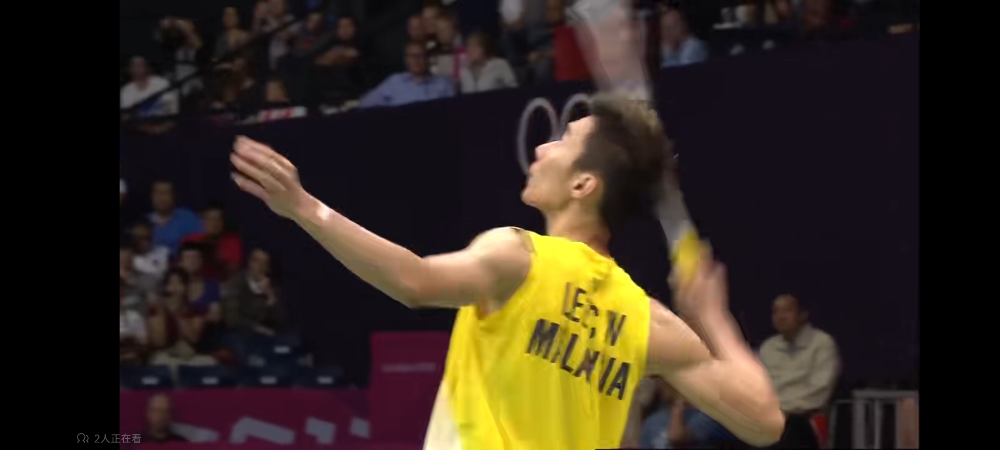
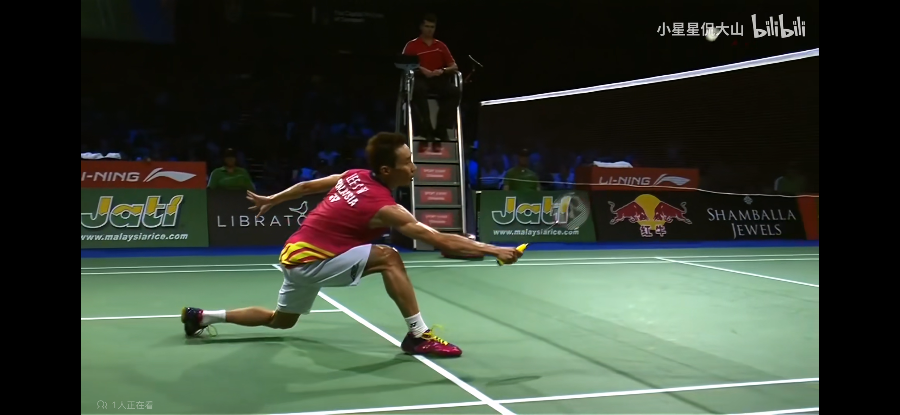
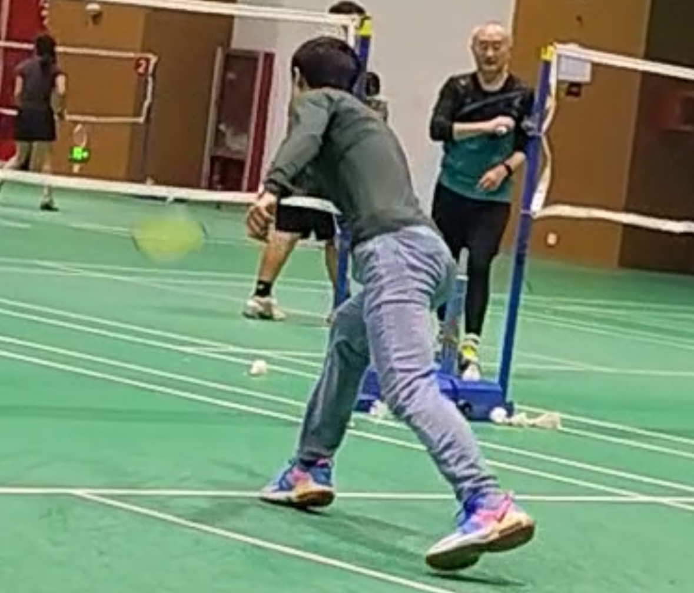

- [Badminton- wikipedia](https://en.wikipedia.org/wiki/Badminton#External_links)
# 前言

## 基本球路
如下图所示，

## 击球点
- 《Effect of racket-shuttlecock impact location on shot outcome for badminton smashes by elite players》

# 0球拍
- 《Finite Element Analysis on Badminton Racket Design Parameters》
所谓3分线7分拍90分看人，不无道理。但是90分的人就是你自己，不可能是别人，当然已赢球为唯一目标的话，更多的精力确实应该投在技术上。
问题就是绝大多数人打球的目标不是成为下一个林丹，甚至超越林丹。那么在《打球就是给对面喂球》和《超越林丹》之间，每个人对技术追求的程度不同，人生只有几十年，适可而止，还是为了活一个开心，so，如果研究球拍也是一个人的兴趣点的话，何乐不为，但是为了虚荣的话，还是适可而止，不过话说回来，为了赢球不也是虚荣吗，如果没有人，赢球给谁看呢，赢谁呢？这就是哲学问题了。
目前对我来讲，可能中羽6级左右会是我对羽毛球技术失去兴趣的节点，对我来说那时的投入产出比不如我探索这世界的其他领域有意思。
选择球拍（Badminton rackets）还是比较关键，但是比如初学者只要选个大牌子百元左右的碳素拍就基本没啥区别，但是随着技术提升，球拍各个参数的重要性也开始显现，下面按照重要性从高到低依次讲。
## 0.1 重量&手柄
这点是最重要的，即使不会打球也能明显判断出区别。

## 0.2 磅数
磅数（Badminton string tension）是掌握发力技巧后最明显能感受到的（重量之前就选择好差不多的了），磅数及球线的弹性。常见的球拍(线)在22磅到30磅之间，这个区间内，磅数越高弹性越小，球线面越紧绷，同样的力击球后落点越近。
上文对于磅数的理解并不准确，在我看来，即使《Finite Element Analysis on Badminton Racket Design Parameters》3.2.1中研究的磅数与能量损失（COR）之间关系---如果磅数在14到34，能量损失是几乎线性增加----也没有说服力。一方面，磅数与弹性的关系与相对运动速度有关，而绝大多数实验都为了控制变量，对不同磅数采用相同的球速（或者说是挥速+球速）进行对比实验，但正如上述论文3.2.1节最后表示，如果磅数特别低(extremely low)，COR会变的特别低，对此的解释就是线床的形变很大，形变产生的能量损失就大，导致无法有效将弹性势能传递给球。问题就在于，变形量和相对速度（准确的讲是球拍击球位置的转动惯量和球的动量的组合效果）有很大关系，若增加相对速度，那么14磅就会变成这个所谓的“extremely low”，其变形量就会“过大”导致能量损失多。
当然，人类的挥速是有极限的，在这种极限下，高磅数（相对高，差不多20磅以上之类的）不会有这种现象，从论文《Perceiving the affordance of string tension for power strokes in badminton: Expertise allows effective use of all string tensions》的Figure 1就能看出来，高磅数还是不会对球速有帮助的。但是由于更“硬”，形变更小，高磅数对球回转角度的控制会更加精准。
高磅数会将较大的发力区间转化为更小的球速区间，表现为增加了球落点的稳定性，但需要的发力区间下限很高，所以也常被等同于高手的选择，但并不完全是（高手一定不选择低磅，但选择高磅的不一定是高手）。

## 0.3 平衡点与挥重
因为握拍都是握在手柄，而拍子可以看作一个杠杆（跷跷板），所以需要维持或者挥动的力量是一个力矩，不仅和拍子的重量有关，还与平衡点的位置（影响杠杆的力臂）有关。
所谓“进攻拍”、“平衡拍”、“控制拍”，主要就是指：平衡点的不同。平衡点高，则拍头“沉”（相对），挥重更大，因为球拍重量不变，但它的力臂长，所以对人的力量要求更高，当然也可以握拍向“上”一点（漏出来多一点）让挥重变小，原因就是增加了人这一端的力臂，所以需要的力量更小。
对于同样质量的拍子（长度也一致），平衡点高低是挥重最直接最关键影响因素，因为所谓挥重，就是转动惯量，当然，准确的讲是某一轴（下图Is）的惯性矩，这个转动惯量不同，但都是表达在转动时的惯性。

参考：
- 《Effects of racket moment of inertia on racket head speed, impact location and shuttlecock speed during the badminton smash》
- 《Finite Element Analysis on Badminton Racket Design Parameters》1.5.2节。
有一个观点，去不去底胶对挥重影响较小，是有其道理的（我还没有定量的证明这个问题），但被有些人错误解读为平衡点对挥重影响较小，是不对的。去底胶减小了重量，提升了平衡点，可以理解为，同样的力，质量低了但是速度高了，所以两者变化对动量的影响是相反的。

## 0.4 中杆弹性
这点也是所谓高端拍和中低端拍的主要区分点，但这个参数对击球的作用上和磅数非常相像，这个弹性要和力量、发力技术、打法等相匹配才行。也是相对的高低（当然是有绝对的高低，但这是指业余选手的标准和职业选手就很不同）。

## 0.5 框型
这个目前还没有深入研究。
- 《Finite Element Analysis on Badminton Racket Design Parameters》第五章《Head Shape Design Analysis of Conceptual Badminton Racket》

## 0.6 球拍对球速的影响因素
球速是羽毛球基础技术学习的核心追求。要学习握拍、发力主要也是为了能在不同情况下能打出球速（当然，基础之上，就不只有球速，比如发力“前摇动作”的速度甚至比球速更重要，这会在下面章节提及，再比如球路选择等中后期也很重要）。
球速可以分为两大部分，人和拍子。这部分当然是只探讨占比10%的拍子，下文中握拍和挥拍章节是关于人的技术。

---
我想用两个东西来举例：锤子和苍蝇拍。
1. 锤子。   
2. 苍蝇拍。
锤子就是一个头很重(平衡点很高)，重量很重，挥重极大，磅数很高，中杆极硬的拍子；苍蝇拍就是一个“破风框”，中杆极软，磅数低，平衡点低，挥重小，但是挥速快的拍子。高手能把锤子当苍蝇拍，但是就代表锤子比苍蝇拍更好吗？但这时业余球员常常犯的错误。
### 非刚体---波的传递
挥重这个概念下，挥拍出挥速是假设球拍是一个刚体，但事实不是这样，我们挥拍时产生的加速度很大，由于拍头的惯性(保持原来运动状态)&拍柄和手没有相对移动，所以使得中杆部位产生了弯曲形变，也就是常说的挥出了中杆形变。
值得注意的是，这个中杆形变是挥拍动作的加速度产生的，而不是速度，这点非常关键。因为较长的“蓄力”时间(挥拍前摇动作)下，打到同样的挥速，这个过程的加速度是较小的(a = ∂v/ ∂t)，而加速度的大小更能衡量一个人的力量和发力技巧，这也就解释了为什么职业男性羽毛球运动员不转身杀或者点杀都能挥出中杆形变，点杀由于蓄力时间小，最终挥速肯定小于大发力动作，但是：一方面他们不转身也依然能在较小幅度最大化的利用身体的发力，比如在头顶区后仰然后“卷腹”，将这个身体的加速度传导到大臂，同时大臂引动幅度更小，但小臂内旋作用不会减弱，在这个较短动作时间内产生的加速度依然巨大，所以就已然能挥出中杆形变。
中杆的形变在击球前（也就是挥拍动作后段），会恢复，也就会将形变积累的弹性势能释放出来，从而达到在击球前的瞬间再次加速拍头。当然这要求此时手必须要抓紧球拍并保持稳定，否则这个形变恢复是拍柄位移的话，就尴尬了。但一般这不是问题，因为能挥出中杆形变来的球员这种动作细节也都问题不大了。
### 挥重、磅数和中杆硬度与发力前摇时间的取舍 
如果说中杆形变时因为挥拍过程中的加速度决定的，那么拍面的球线对球的弹性势能的积累与释放过程就是挥重决定的。击球瞬间，球的速度在极短的时间内变成0，这个能量会导致拍头的动能衰减，球线的弹性变形势能增加。中杆形变恢复释放弹性势能使拍头动能增加，球线形变恢复释放弹性势能直接作用于羽毛球，使其在极短的时间内转向并加速，最终羽毛球的飞行速度和方向决定了它的落点。
其实还有一点很关键，正如挥拍加速度决定了中杆形变，羽毛球的离开拍面的最终速度也不是决定落点的唯一因素(当然空气阻力，风啥的会影响，我指的是球拍)。也就是这个加速过程的加速度，这个加速度影响的是羽毛球羽毛收紧的程度！这个很少有人讲到，确实也不太好量化分析，我这只是定性分析：
```
想象两种极端情况：
1. 用拍子慢慢的把羽毛球推出去，但是我一直加速，我可以跑到200km/h，然后此时拍面上的羽毛球也是200km/h，此时我突然刹住，羽毛球"自由"落体。
2. 林丹不转身正手平高球，他的发力使得球拍在极短时间内挥出中杆形变，转瞬之间羽毛球加速到200km/h，离开拍面“自由”落体。
```

假设这两种情况球是一样的，离开拍面的起始点和角度相同，林丹这个球要比我飞的远。为什么？羽毛球的羽毛也是有弹性的，而收紧的毛会大大降低撞风面积，从而减少羽毛球飞行过程中的空气阻力，让其飞的平均速度更快，落点更远。而上述第一种情况，羽毛球的球毛几乎不会收紧，应该能想象的出来吧？原因也很简单，羽毛球球毛的收紧是羽毛球的加速度决定的，球毛的惯性（保持原有运动状态）会倾向于"留在拍面上"，而球头加速度越大，球毛就会因为惯性收紧越重，减速效果越小。
所以：所谓重杀和点杀，有人说重杀的重不是快，是错的。这种情况是想表达重杀因为羽毛球停留时间长，所以收紧程度小，初速度更快但是减速较明显。但话说回来，（虽然我没做过对照试验和理论的定量分析），点杀的所谓快，主要还是指蓄力动作小，这个前摇动作的时间差带来的“快”要高于羽毛球毛“收的更紧”带来的“快”。
Anyway，说回本节标题。很多人说合适的磅数或者中杆硬度的拍子，要看你能不能被动回到底线的高远。这个观点不无道理，当然这仅适用于发力技巧已经过了基础阶段的人，还在基础阶段啥磅数也回不到被动高远那就是技术问题还得连技术(我就还到不了这个技术哈哈哈)。这句话的道理就很好的诠释了标题中的取舍：所谓被动，就是留给自己做完整发力动作的时间很少，所以这时候就需要类似不转身动作，甚至更精简的动作，这是肯定不能产生同样的挥重，这时如果是一个磅数低的球线，弹性更大，中杆软的球拍在更小的加速度下积累的弹性势能更大，就可以更容易打出更快的球速。
这就是用锤子很难达到苍蝇，而苍蝇拍也砸不动钉子。但是球拍需要在这两者之间做取舍。

## 手胶对重量、手柄和平衡点的影响
- [如何缠缓震膜，缠几层舒适呢，对手柄粗细影响又如何](https://bbs.badmintoncn.com/forum.php?mod=viewthread&tid=1358858)
手胶尤其是底胶/毛巾胶，对重量和平衡点的影响是很大的！一个普通手胶重5-6g，就是一个U的重量，买来拍子不去底胶直接缠手胶会使平衡点降低3-5mm，所以想要保证拍子本身重量和平衡点，需要去底。但底胶重8-10g不等，去掉之后会直接降低两个U，当然肯定会上底胶和缓震膜等，这是还是会轻一点。如果觉得轻，可以缠一层电工胶带（不建议，一般4U或5U的球拍都是80g左右，真不轻，觉得轻还是发力技术有问题，挥不出挥速导致需要球拍重量来增加挥重，治标不治本）
去底胶对平衡点的影响还是很大的，会上移10mm左右，如果就是为了上调平衡点，那就正好可以去底胶，但即使G5的手柄，去了底胶之后还是很细，需要保鲜膜打底之后缠4层缓震膜，否则硌手，手大的还会因为太细磨手。这样再缠手胶会比拍子原本平衡点上移5mm左右。
比如我个人的拍子，5U小铁锤穿线不去底缠手胶平衡点310mm重88g；4U的纳米7sp穿线去底缠4“单”层缓震膜+手胶平衡点310mm重88g。所以，这两个完全不同定位的拍子，因为去不去底变得几乎一致，当然小铁锥中杆还是更软一些。
有人可能会杠就一个手胶哪这么多讲究，或者高手用啥都能打爆你，当然技术更重要。但我要说的是，如果1U-2U的重量感觉不出来，5-10mm的平衡点感觉不出来，那可能技术也不会太高，而且如果这个感觉不出来，那更没必要纠结平衡拍还是进攻拍，4U还是5U甚至3U，因为他们的差距小于去不去底，所以一定也感觉不出来。
By The Way，G6手柄还是不建议去底胶了，直接保鲜膜加手胶，所以相对买平衡点比预期高一点的（一般G6手柄是5U拍子，平衡点再低的话，挥重实在太小无力感太强）

# 1握拍
握拍角度需要根据击球位置变化的核心逻辑是：在不同的击球位置做击球瞬间的动作，能舒服（能发力）把将拍面与球飞行轨迹垂直。
## 1.1正手握拍
李宗伟式：


### 正手握拍注意事项
首先一定是半拳式。为什么不是拳式李雨轩的视频中讲到了。但是有些球员在杀球的尾段动作看起来是拳式，其实也不是，只是半拳式握紧之后的状态，看下图：

注意拇指和食指几乎在一个高度，很像拳式了，但并不是。看下图我拳式的错误示范就清楚区别了：

这种拳式的问题不用我再阐述了，最好还是半拳式，可以在握紧之后像林丹一样拇指提上来一点，便于握紧。

1. 正手标准握拍


2. 正手劈吊握拍


3. 正手后场被动握拍

### 1.2反手握拍
1. 反手标准握拍
2. 反手被动握拍


# 2挥拍
挥拍的最终目的是保证稳定的前提下获得最大拍面速度；核心就是要将大臂，小臂，球拍挥出鞭子的效果（不在一条直线上，这样线速度依次提升，最终拍面获得极大的速度，从而获得极大球速） 
注：实战也不完全是追求拍速球速，比如点杀就是牺牲最大速度，减少了前摇时间，从而压缩了对手的总反应时间，也就是所谓的杀球快杀球重的优缺点。
## 架拍

上图是我的错误示范，问题出在两个大臂都“沉下去了”，这样不利于力传导。架拍过程中持拍手沉下一点可以接受，但是引拍前要提上来，也就是刘辉教练说的提升框架。
下面看看李宗伟就明白了：

架拍也是这样沉下来一些，但是下一张图：

可以看到在引拍之前，他的持拍手和肩膀已经在一条直线上了。
## 关于侧身
上述点杀和重杀的原因主要就在于身体介入的程度，不侧身或者半侧身击球的挥速肯定是不如侧身充分的挥速的。但是减少侧身时间对于时间和空间的节省有着重要意义，类似点杀和重杀，一是对手来球没有足够的时间侧身，二是即使有充足时间，也可以不侧身提速突击压缩对手的反应时间，虽然球速慢一些，但是节省的总体时间还是显著的！
当然充分侧身转体的重杀和劈吊也是要练习的基本功，这样和不侧身的突击结合才有变速的效果，类比一下：如果只吊球不杀球，那吊球毫无威慑力，只有杀球有威胁，吊球才能骗到对手。

## 2.0 挥拍导致的上肢运动损伤
### 不标准的动作是新手关节韧带损伤的最主要原因
### 肩膀疼问题
1. 大概率是“抡大臂”了，需要改正抡大臂的点：**要抬肘；切击球前后不要“掉肘”**，大臂带动了小臂之后就停的感觉（也不是完全停住，而是传导到小臂接下来就是小臂内旋手抓紧击球，再小臂顺势外旋卸力）
2. 击球前的引拍动作转身动作过度挤压肩膀后侧？这是我的推测。改正方法目前定为：转身引拍动作，要保证肩膀肌肉"紧张"起来带动胳膊旋转，不要让胳膊主动挤压肩膀（有点像挺直腰扎马步保护腰椎）--- [链接文章](https://bbs.badmintoncn.com/thread-1356968-1-1.html)中第一个评论讲到，多多锻炼肩胛骨"后收"的能力，及肩膀肌肉"紧张"起来带动胳膊的能力。
3. 反手的确会用到肩膀，但还是重点为鞭甩。
4. 肩峰撞击，这是因为挥拍没有在右前方，而是在正前方，导致挤压三角肌和肩膀外侧，要么就身体向另一侧击球，要么右前方击球。

### 手腕疼问题
- 需要改正不撅手腕的两个点：
3. 正手接杀和被动球过渡斜线（球拍稍微转10度，斜线要多让身位，挥拍后程击球）
4. 后场正手和头顶稍被动时吊球（也就是稍被动的劈吊和滑板，可不转拍，最好转一下拍子，劈吊要转“着”打，不要转正，挥拍前半程击球；滑板不要变拍，要过度转，挥拍后半程击球）


## 2.1正手后场：
身体带动大臂，大臂带动小臂，击球点在斜上方。

### 击球点太低的问题
- 新手在掌握动作后普遍存在击球点**偏前偏低**的问题，主要原因是挥拍时机偏晚，这样会导致两个后果：
1. 引拍动作“紧缩”不充分，挥不出速度；
2. 拍子没有到挥速最大时击球，导致最后最关键的小臂内旋发力浪费。

即使空挥拍动作比较标准，还是会存在一击球又“打回原形”的问题，比如下面就是我空挥拍和击球时的动作：
1. 空挥拍（较为正确的动作）

2. 实战击球动作（错误，击球点太低）

**如何改击球点？**


## 2.2反手过渡
身体侧方握在斜楞，很被动（身体后方）握在侧棱，手臂不要伸直（否则肘会受伤），抬肘引拍，然后类似甩手动作打出“反着”的鞭打效果。
**动作的末端击球**（这点像反手勾对角）

## 2.3 搓球
- 不要用手腕发力
- 保持拍头下沉
### 2.3.1 正手搓球


# 3步伐
要从击球后就有部分回中（不需要完全回中，回中速度也根据当前双方可能的球路有所不同），与此同时观察对手动作。而不是击球后站在原地注视球的轨迹，这时新手常犯的错误。

## 3.0 步伐导致的下肢运动损伤
### 不标准的动作是新手关节韧带损伤的最主要原因
比如膝盖疼，腰疼，手腕疼，肩膀疼，尤其是对于新手，9成9的概率是动作不对导致的。而不是劳损或力量不够。力量不够是会导致这种问题，但是新手尤其是成年人力量不足会首先导致肌肉拉伤或劳损，而不是关节和韧带，而后者先出现问题大概了就是动作不标准导致的关节负荷过大。
而我就是看了“网上”一堆说什么力量不足或者没有充分拉伸之类的，导致没有首先把精力放在仔细研究动作上。疼了几个月。

比如膝盖疼，大概率是网前步伐姿势不标准。网前步伐姿势（先不谈技战术或者步伐种类等）主要分为两个阶段，一个是启动后的弓箭步，另一个是
#### 1. 弓箭步动作
一个是要弯腿网前迈出去，重心压下去，另外非持拍手手要保持平衡。下图李宗伟的就是正确动作，而我的就是典型错误（虽然已经相比最开始学羽毛球迈开了一些，但是不够，导致还想够到球就要膝盖超脚，重心压到膝盖上，膝盖承受了巨大压力）而相比之下，李宗伟的这个标准动作压力再右侧大腿肌肉上，而这时如何肌肉力量支撑不住会出现不稳定也会损伤膝盖甚至脚踝，但前提是做出了这个动作，而我了解的初学者是不会做这种动作的。如果打球时动作没问题，但这个动作不能稳定，那肯定还是要加强股四头肌力量。
#### 2. 回收重心
非持拍手和对应腿要起到很关键的作用，比如对于右手持拍的球员，左手要动态的抬高下压或者后摆来控制重心稳定，左腿要适当回收来避免靠右腿单腿力量“刹车”甚至回位。


我的网前步伐错误动作：不仅是没收左腿，且左手没有抬起来平衡重心（左手球员就反过来）



如果动作非常标准，强度且多大，才有可能是肌肉力量的问题，如下：
### 膝盖上侧疼
- [羽毛球膝-股四头肌问题#羽毛球#李博士拉伸-哔哩哔哩](https://b23.tv/ORKksO9)
股四头肌问题，也就是大腿前内侧肌肉，单腿站立抬腿拉伸。
### 脚背扭伤
1. [脚背筋膜紧张](https://b23.tv/mAwzVIQ)
2. 小腿前侧肌肉紧张

### 屁股酸痛
- [羽毛球-屁股酸痛#羽毛球#李博士拉伸-哔哩哔哩](https://b23.tv/LWFnEdU)
二郎腿下蹲拉伸臀大肌。

## 3.0 左手
左手要随重心“流动”而挥动，下手球左手要向后上方抬起；后场要向前上方抬起，并在挥拍初始阶段“拉下”。
当然，左手球员就指的是右手了。

## 3.1启动
- 启动前要**脚后跟抬起，脚尖点地**
- 启动要**压低重心**（扎马步的感觉，但是不至于压低很多，注意度）
- 启动要**双腿向外打开**（不能太大或太小）
- 启动后的一瞬间，**想要去的方向相反的那条腿蹬地发力**
- 启动是判断出对面球路的一瞬间，但是可以稍微提前一个0.2s之类的，因为真正判断蹬地发力腿之前还是有比如开，重心压低等前摇动作的。（但是初学者可以不用，容仪分不清主次反而造成提前启动）
- 可能被杀就平行启动；不可能被杀就前后启动；前后启动还是要比肩略宽
- 学会在**回位过程中启动（直接判断出方向单腿蹬的感觉）**
### 3.1.1 回中与启动的时机
如果打了高远球，那么回两步（第一步收回/稳定重心，第二步往中场并一步），因为高远球飞行时间长，且对面可能的球路广，尽量充分回中&平行启动。
如果不是，比如劈吊或者放网，回一步（收回/稳定重心）就要启动，因为很短的时间内对面就会碰球，比如劈吊了，如果你担心它放网并几步回中，那么被推底线几乎就是无解（因为在回中的过程中就被推了，再改变重心的运动轨迹很难）；再比如放网，如果怕被推回中，可能过程中就被回搓了。
总结一下就是，打了球第一时间回收重心，做好启动的准备再酌情回到“多么中间”。

## 3.2网前步伐
- 平行启动的话，基本并步；斗网前的前后启动，如果对方回的高质量网前最好用交叉跑；（这点上正反手都是一样）
- 挡网回位用并步退（节奏快，反应快）

## 3.3后场步伐
这个分头顶和正手，头顶和反手后场区域一样，但是正手击球，为不被动时的优选
### 3.3.1后场步伐（正手）

**被动**：
- 球不过我，并步；
- 球过我，一定要后交叉；
- 被动不要转身，来不及。
### 3.3.2后场步伐（反手）
一般被动是选择，也可在节约体力是不选择头顶而是反手。
- 这个关键还是要和反手握拍挥拍动作结合，回出反手被动吊球，或者高远。
- 择机选择退一步再转身还是直接转身。

# 4练习方法
因为前面已经把握拍、挥拍发力、步伐等基本功的基本功讲完了，接下来的练习方法主要是指的单一技术的训练，见[[羽毛球训练规程]]。

# 5 高级技术

## 5.1观察站位与站位选择


## 5.2 降点停顿


## 5.3 过渡远网或中路
这可以极大限制对手网前进行降点停顿。 要加力加快点球速，不用追求那么贴网。过渡中路远网可以限制对手的回球角度，让自己的场地“变小”，减少体能消耗，慢慢寻求得分机会。
这个和四方球的拉吊打法是矛盾的，但这不是全场贯彻的打法，就类似劈吊和平高，只用一种没有效果，要结合对手习惯，交替使用才有效。当对手站位出现明显侧重点时，下一拍可以打其转身点的拉吊球；而对手回位很快，自己容易吃停顿二次启动、体能下降等情况，可以采用过渡远网或中路。

# 6 分解球路
对手在不同位置，面对不同落点的球，所能回球的选择和路线是有所不同的，这些选择对自己的威胁等级也不同，所以实战中的站位不会是绝对回中，也不是只简单的分为平行启动和前后启动两种。这一章节就一些常见的球路，分析得到一些针对性的方案，然后再训练成肌肉记忆。