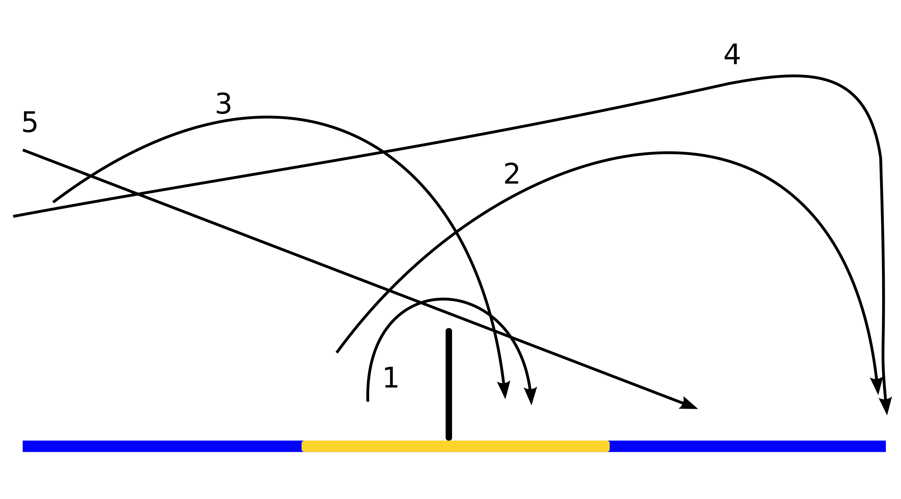
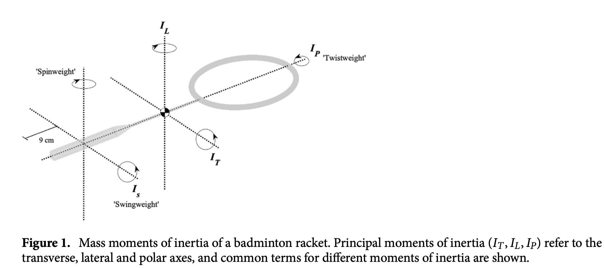

- [Badminton- wikipedia](https://en.wikipedia.org/wiki/Badminton#External_links)
# 前言

## 基本球路
如下图所示，

## 击球点
- 《Effect of racket-shuttlecock impact location on shot outcome for badminton smashes by elite players》

# 0球拍
- 《Finite Element Analysis on Badminton Racket Design Parameters》
选择球拍（Badminton rackets）还是比较关键，但是比如初学者只要选个大牌子百元左右的碳素拍就基本没啥区别，但是随着技术提升，球拍各个参数的重要性也开始显现，下面按照重要性从高到低依次讲。
## 0.1 重量&手柄
这点是最重要的，即使不会打球也能明显判断出区别。

## 0.2 磅数
磅数（Badminton string tension）是掌握发力技巧后最明显能感受到的（重量之前就选择好差不多的了），磅数及球线的弹性。常见的球拍(线)在22磅到30磅之间，这个区间内，磅数越高弹性越小，球线面越紧绷，同样的力击球后落点越近。
上文对于磅数的理解并不准确，在我看来，即使《Finite Element Analysis on Badminton Racket Design Parameters》3.2.1中研究的磅数与能量损失（COR）之间关系---如果磅数在14到34，能量损失是几乎线性增加----也没有说服力。一方面，磅数与弹性的关系与相对运动速度有关，而绝大多数实验都为了控制变量，对不同磅数采用相同的球速（或者说是挥速+球速）进行对比实验，但正如上述论文3.2.1节最后表示，如果磅数特别低(extremely low)，COR会变的特别低，对此的解释就是线床的形变很大，形变产生的能量损失就大，导致无法有效将弹性势能传递给球。问题就在于，变形量和相对速度（准确的讲是球拍击球位置的转动惯量和球的动量的组合效果）有很大关系，若增加相对速度，那么14磅就会变成这个所谓的“extremely low”，其变形量就会“过大”导致能量损失多。
当然，人类的挥速是有极限的，在这种极限下，高磅数（相对高，差不多20磅以上之类的）不会有这种现象，从论文《Perceiving the affordance of string tension for power strokes in badminton: Expertise allows effective use of all string tensions》的Figure 1就能看出来，高磅数还是不会对球速有帮助的。但是由于更“硬”，形变更小，高磅数对球回转角度的控制会更加精准。

## 0.3 平衡点与挥重
因为握拍都是握在手柄，而拍子可以看作一个杠杆（跷跷板），所以需要维持或者挥动的力量是一个力矩，不仅和拍子的重量有关，还与平衡点的位置（影响杠杆的力臂）有关。
所谓“进攻拍”、“平衡拍”、“控制拍”，主要就是指：平衡点的不同。平衡点高，则拍头“沉”（相对），挥重更大，因为球拍重量不变，但它的力臂长，所以对人的力量要求更高，当然也可以握拍向“上”一点（漏出来多一点）让挥重变小，原因就是增加了人这一端的力臂，所以需要的力量更小。
对于同样质量的拍子（长度也一致），平衡点高低是挥重最直接最关键影响因素，因为所谓挥重，就是转动惯量，当然，准确的讲是某一轴（下图Is）的惯性矩，这个转动惯量不同，但都是表达在转动时的惯性。

参考：
- 《Effects of racket moment of inertia on racket head speed, impact location and shuttlecock speed during the badminton smash》
- 《Finite Element Analysis on Badminton Racket Design Parameters》1.5.2节。
有一个观点，去不去底胶对挥重影响较小，是有其道理的（我还没有证明这个问题），但被有些人错误解读为平衡点对挥重影响较小，是不对的。去底胶减小了重量，提升了平衡点，可以理解为，同样的力，质量低了但是速度高了，所以两者变化对动量的影响是相反的。

## 0.4 中杆弹性
这点也是所谓高端拍和中低端拍的主要区分点，但是这个类似磅数，这个弹性要和力量、发力技术、打法等相匹配才行。也是相对的高低（当然是有绝对的高低，但这是指业余选手的标准和职业选手就很不同）。

## 0.5 框型

## 手胶对重量、手柄和平衡点的影响
- [如何缠缓震膜，缠几层舒适呢，对手柄粗细影响又如何](https://bbs.badmintoncn.com/forum.php?mod=viewthread&tid=1358858)
手胶尤其是底胶/毛巾胶，对重量和平衡点的影响是很大的！一个普通手胶重5-6g，就是一个U的重量，买来拍子不去底胶直接缠手胶会使平衡点降低3-5mm，所以想要保证拍子本身重量和平衡点，需要去底。但底胶重8-10g不等，去掉之后会直接降低两个U，当然肯定会上底胶和缓震膜等，这是还是会轻一点。如果觉得轻，可以缠一层电工胶带（不建议，一般4U或5U的球拍都是80g左右，真不轻，觉得轻还是发力技术有问题，挥不出挥速导致需要球拍重量来增加挥重，治标不治本）
去底胶对平衡点的影响还是很大的，会上移10mm左右，如果就是为了上调平衡点，那就正好可以去底胶，但即使G5的手柄，去了底胶之后还是很细，需要保鲜膜打底之后缠4层缓震膜，否则硌手，手大的还会因为太细磨手。这样再缠手胶会比拍子原本平衡点上移5mm左右。
比如我个人的拍子，5U小铁锤穿线不去底缠手胶平衡点310mm重88g；4U的纳米7sp穿线去底缠4“单”层缓震膜+手胶平衡点310mm重88g。所以，这两个完全不同定位的拍子，因为去不去底变得几乎一致，当然小铁锥中杆还是更软一些。
有人可能会杠就一个手胶哪这么多讲究，或者高手用啥都能打爆你，当然技术更重要。但我要说的是，如果1U-2U的重量感觉不出来，5-10mm的平衡点感觉不出来，那可能技术也不会太高，而且如果这个感觉不出来，那更没必要纠结平衡拍还是进攻拍，4U还是5U甚至3U，因为他们的差距小于去不去底，所以一定也感觉不出来。
By The Way，G6手柄还是不建议去底胶了，直接保鲜膜加手胶，所以相对买平衡点比预期高一点的（一般G6手柄是5U拍子，平衡点再低的话，挥重实在太小无力感太强）

# 1握拍
握拍角度需要根据击球位置变化的核心逻辑是：在不同的击球位置做击球瞬间的动作，能舒服（能发力）把将拍面与球飞行轨迹垂直。
## 1.1正手握拍
1. 正手标准握拍
2. 正手劈吊握拍
3. 正手后场被动握拍

### 1.2反手握拍
1. 反手标准握拍
2. 反手被动握拍

# 2挥拍
挥拍的最终目的是保证稳定的前提下获得最大拍面速度；核心就是要将大臂，小臂，球拍挥出鞭子的效果（不在一条直线上，这样线速度依次提升，最终拍面获得极大的速度，从而获得极大球速） 
注：实战也不完全是追求拍速球速，比如点杀就是牺牲最大速度，减少了前摇时间，从而压缩了对手的总反应时间，也就是所谓的杀球快杀球重的优缺点。
## 关于侧身
上述点杀和重杀的原因主要就在于身体介入的程度，不侧身或者半侧身击球的挥速肯定是不如侧身充分的挥速的。但是减少侧身时间对于时间和空间的节省有着重要意义，类似点杀和重杀，一是对手来球没有足够的时间侧身，二是即使有充足时间，也可以不侧身提速突击压缩对手的反应时间，虽然球速慢一些，但是节省的总体时间还是显著的！
当然充分侧身转体的重杀和劈吊也是要练习的基本功，这样和不侧身的突击结合才有变速的效果，类比一下：如果只吊球不杀球，那吊球毫无威慑力，只有杀球有威胁，吊球才能骗到对手。

## 2.1正手后场：
身体带动大臂，大臂带动小臂，击球点在斜上方。

- 新手在掌握动作后普遍存在击球点偏前偏低的问题，主要原因是挥拍时机偏晚，这样会导致两个后果：
1. 引拍动作“紧缩”不充分，挥不出速度；
2. 拍子没有到挥速最大时击球，导致最后最关键的小臂内旋发力浪费。

- 需要改正抡大臂的点：**要抬肘；切击球前后不要“掉肘”**，大臂带动了小臂之后就停的感觉（也不是完全停住，而是传导到小臂接下来就是小臂内旋手抓紧击球，再小臂顺势外旋卸力）

- 需要改正不撅手腕的两个点：
3. 正手接杀和被动球过渡斜线（球拍稍微转10度，斜线要多让身位，挥拍后程击球）
4. 后场正手和头顶稍被动时吊球（也就是稍被动的劈吊和滑板，可不转拍，最好转一下拍子，劈吊要转“着”打，不要转正，挥拍前半程击球；滑板不要变拍，要过度转，挥拍后半程击球）

## 2.2反手过渡
身体侧方握在斜楞，很被动（身体后方）握在侧棱，手臂不要伸直（否则肘会受伤），抬肘引拍，然后类似甩手动作打出“反着”的鞭打效果。
**动作的末端击球**（这点像反手勾对角）

## 2.3 搓球
- 不要用手腕发力
- 保持拍头下沉
### 2.3.1 正手搓球

# 3步伐
要从击球后就有部分回中（不需要完全回中，回中速度也根据当前双方可能的球路有所不同），与此同时观察对手动作。而不是击球后站在原地注视球的轨迹，这时新手常犯的错误。
## 3.1启动
- 启动前要**脚后跟抬起，脚尖点地**
- 启动要**压低重心**（扎马步的感觉，但是不至于压低很多，注意度）
- 启动要**双腿向外打开**（不能太大或太小）
- 启动后的一瞬间，**想要去的方向相反的那条腿蹬地发力**
- 启动是判断出对面球路的一瞬间，但是可以稍微提前一个0.2s之类的，因为真正判断蹬地发力腿之前还是有比如开，重心压低等前摇动作的。（但是初学者可以不用，容仪分不清主次反而造成提前启动）
- 可能被杀就平行启动；不可能被杀就前后启动；前后启动还是要比肩略宽
- 学会在**回位过程中启动（直接判断出方向单腿蹬的感觉）**

## 3.2网前步伐
- 平行启动的话，基本并步；斗网前的前后启动，如果对方回的高质量网前最好用交叉跑；（这点上正反手都是一样）
- 挡网回位用并步退（节奏快，反应快）

## 3.3后场步伐
这个分头顶和正手，头顶和反手后场区域一样，但是正手击球，为不被动时的优选
### 3.3.1后场步伐（正手）

**被动**：
- 球不过我，并步；
- 球过我，一定要后交叉；
- 被动不要转身，来不及。
### 3.3.2后场步伐（反手）
一般被动是选择，也可在节约体力是不选择头顶而是反手。
- 这个关键还是要和反手握拍挥拍动作结合，回出反手被动吊球，或者高远。
- 择机选择退一步再转身还是直接转身。

# 4练习方法
因为前面已经把握拍、挥拍发力、步伐等基本功的基本功讲完了，接下来的练习方法主要是指的固定球路的训练，见[[羽毛球训练规程]]。

# 5 高级技术

## 5.1观察站位与站位选择

## 5.2 降点停顿

## 5.3 过渡远网或中路
这可以极大限制对手网前进行降点停顿。 要加力加快点球速，不用追求那么贴网。过渡中路远网可以限制对手的回球角度，让自己的场地“变小”，减少体能消耗，慢慢寻求得分机会。
这个和四方球的拉吊打法是矛盾的，但这不是全场贯彻的打法，就类似劈吊和平高，只用一种没有效果，要结合对手习惯，交替使用才有效。当对手站位出现明显侧重点时，下一拍可以打其转身点的拉吊球；而对手回位很快，自己容易吃停顿二次启动、体能下降等情况，可以采用过渡远网或中路。

# 6 分解球路
对手在不同位置，面对不同落点的球，所能回球的选择和路线是有所不同的，这些选择对自己的威胁等级也不同，所以实战中的站位不会是绝对回中，也不是只简单的分为平行启动和前后启动两种。这一章节就针对一些常见的可能性，有针对性的分析一些“固定”的球路。